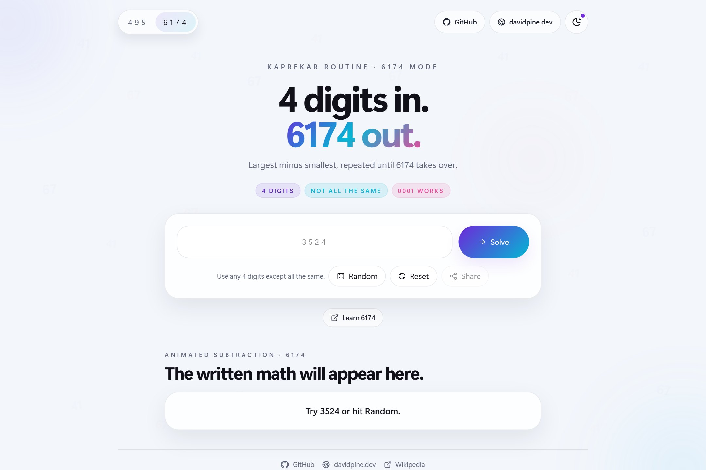
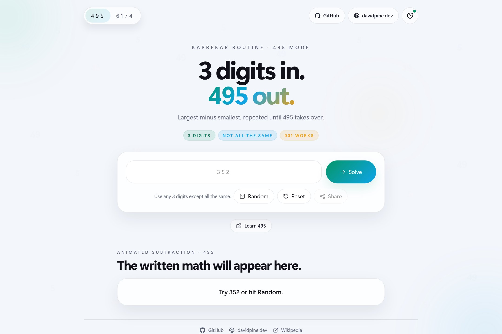
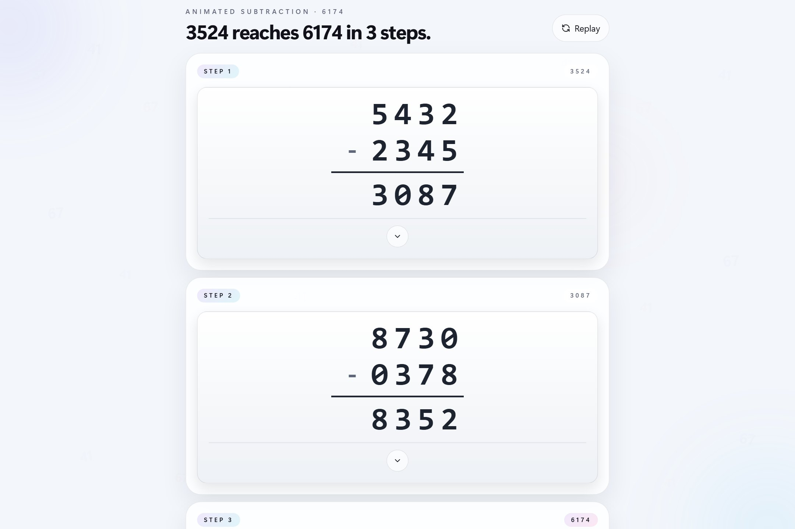
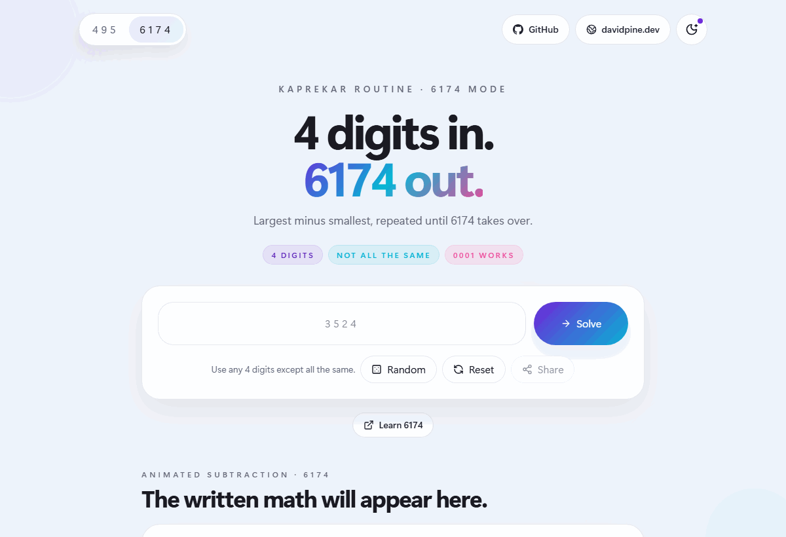

# 6174

A GitHub Pages-ready React + Vite + TypeScript + Tailwind CSS single-page app that animates Kaprekar's routine in two modes: valid 4-digit inputs collapsing into **6174**, or valid 3-digit inputs collapsing into **495**.

**Live site:** https://ievangelist.github.io/6174/

## Screenshots

| 6174 light | 6174 dark |
| --- | --- |
|  |  |

| 495 light | 495 dark |
| --- | --- |
|  |  |

<p align="center">
  
</p>

## Quick walkthrough

<p align="center">
  
</p>

## How to use it

1. Pick **6174** or **495** from the top-left toggle. The selected mode changes both the target constant and the valid seed length.
2. Enter a valid seed or tap **Random** to generate one instantly.
3. Press **Solve** to animate the routine step by step until the constant is reached.
4. Expand any math card with the chevron to see how each subtraction step was built.
5. Use the action buttons to share, replay, reset, or jump back to the top once the sequence is complete.

## Key controls

| Control | What it does |
| --- | --- |
| **6174 / 495** | Switches between the 4-digit and 3-digit Kaprekar routines |
| **Random** | Generates a valid seed for the active mode |
| **Solve** | Starts the animated subtraction sequence |
| **Share** | Shares or copies a deep link for the current seed |
| **Reset** | Clears the current run and starts fresh |
| **Theme toggle** | Switches between light and dark themes |
| **Replay / Back to top** | Re-runs the same sequence or jumps back up after the final card |

## Features

- Oversized input-first interface with random, replay, reset, and share actions
- Top-left routine toggle for **6174** and **495**
- Query-string sharing via `?seed=3524` or `?mode=495&seed=352`
- Generated share-card image files for supported native share targets, plus static Open Graph metadata for crawler-based previews
- Theme-aware styling with light/dark support
- Keyboard-friendly controls, ARIA labels, and reduced-motion-safe animation
- GitHub Pages deployment on merges to `main`

## Local development

```bash
npm install
npm run dev
```

## Scripts

- `npm run dev` - start the Vite dev server
- `npm run build` - run TypeScript build checks and create the production bundle
- `npm run lint` - run ESLint
- `npm run preview` - preview the production build locally

## Deployment

The workflow in `.github/workflows/pages.yml` builds the site and deploys `dist/` to GitHub Pages on pushes to `main`.

If GitHub prompts for a Pages source, choose **GitHub Actions** in the repository settings.
